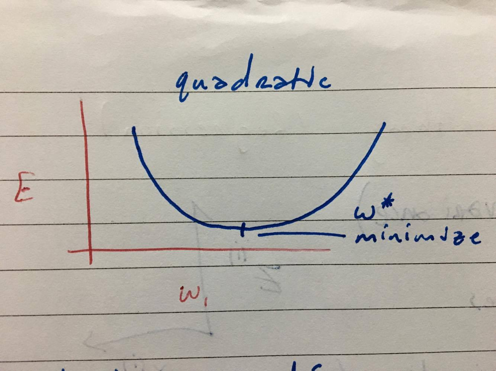
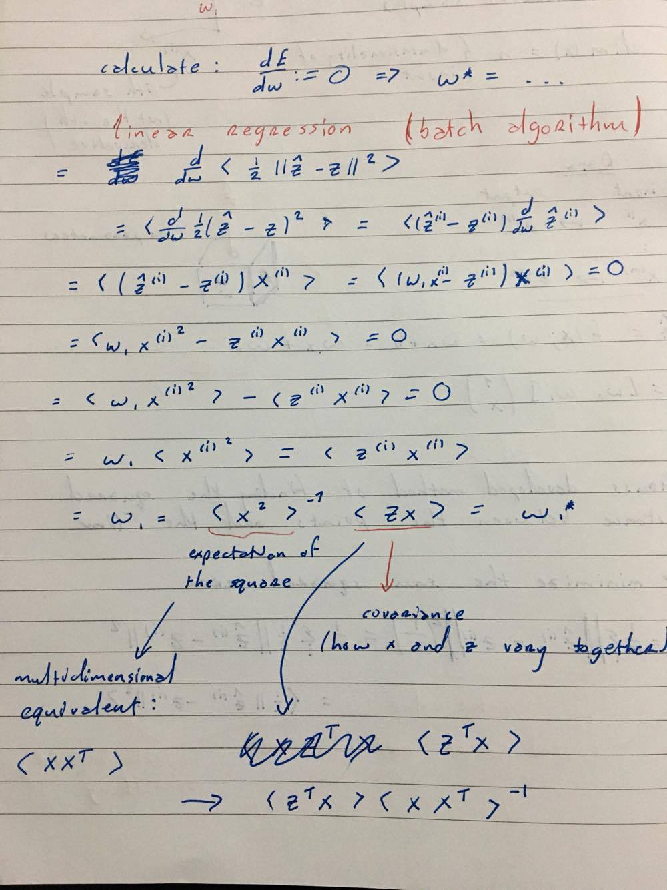

## Machine Learning and Neural Networks - cs401 - Barack Pearlmutter

### Lecture 2

**Machine Learning**
 - Supervised
 - Unsupervised
 - Reinforcement Learning
 
[**Reinforcement Learning**](https://en.wikipedia.org/wiki/Reinforcement_learning) -> Very technically difficult

        

                    

The **World** gives state and rewards (postive or negative) to the **Agent**.
The **World** recieves actions from the **Agent**.

_The objective is to maximize future rewards based on current actions_

##### Games that use reinforcement learning:
- [Chess](https://www.technologyreview.com/s/541276/deep-learning-machine-teaches-itself-chess-in-72-hours-plays-at-international-master/)
- [Go](https://deepmind.com/research/alphago/)    

#### Supervised Learning Algorithms (Regression)

##### boiler plate:
- [overfitting](https://en.wikipedia.org/wiki/Overfitting) (high variance can cause overfitting)
- m = number of samples
- dim(x) = n (dimensionality (size) of input)
- x(i) this is the ith sample not the ith derivative
- w = parameters

##### Data

    input   ->  output
    
    xi -> z(i)
      . 
      .
    x(m) -> z(i)
    
\vec{z} = f(x;w) = wx + b = w_{1}x + w_{0} = w_{1}x + \theta = [w_{0} w_{1}] \binom{1}{x}

[_Gauss developed a method of finding the squared distance between the data points and the line_](https://en.wikipedia.org/wiki/Carl_Friedrich_Gauss)

The objective is to minimize the sum squared error

    
